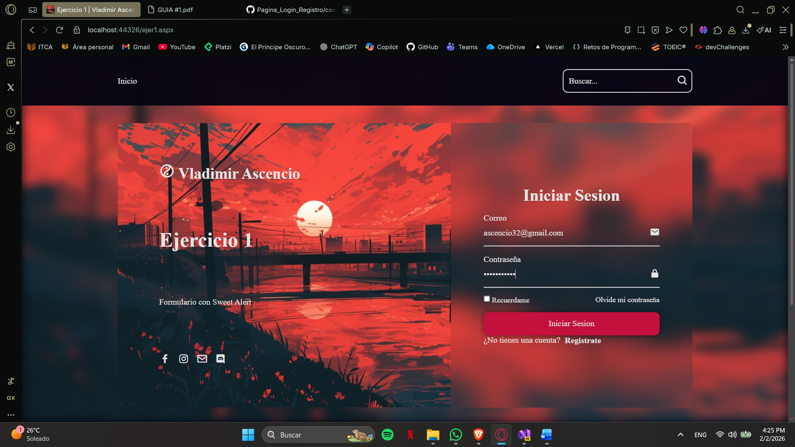
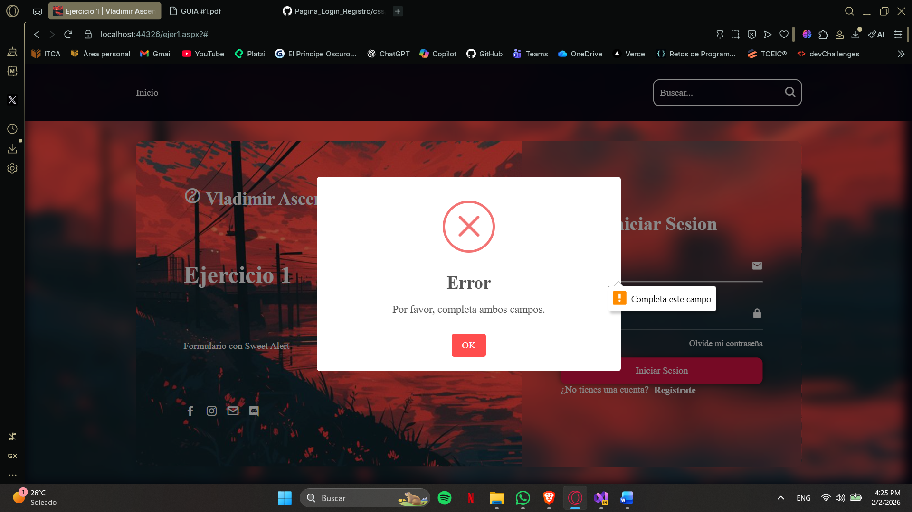
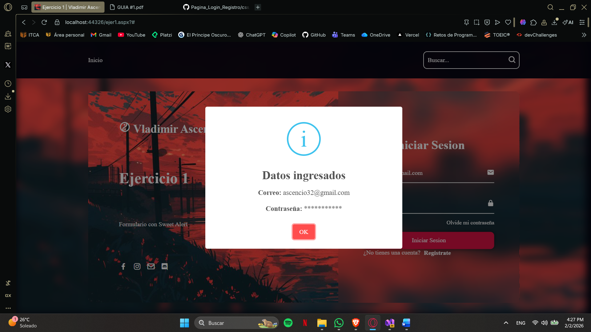
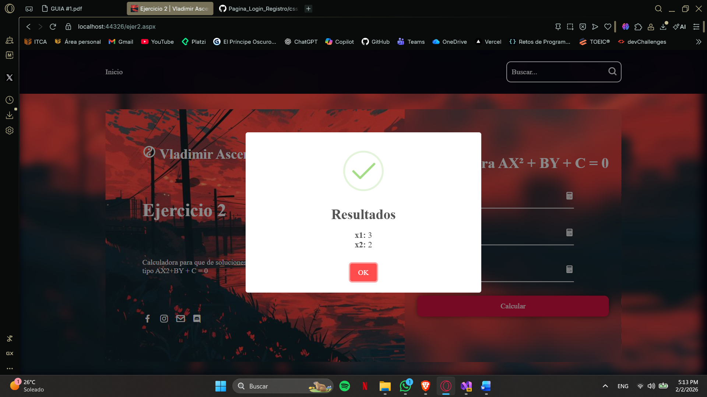
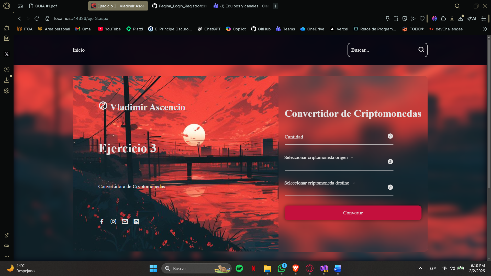
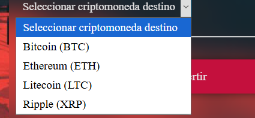
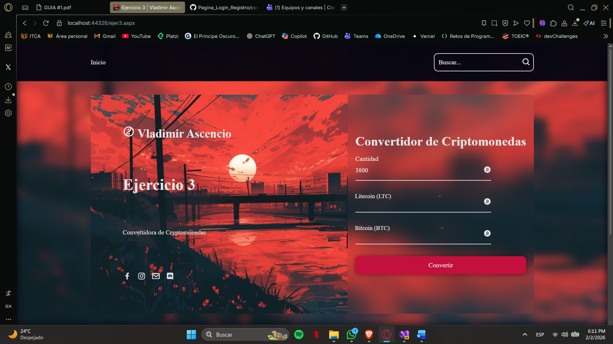
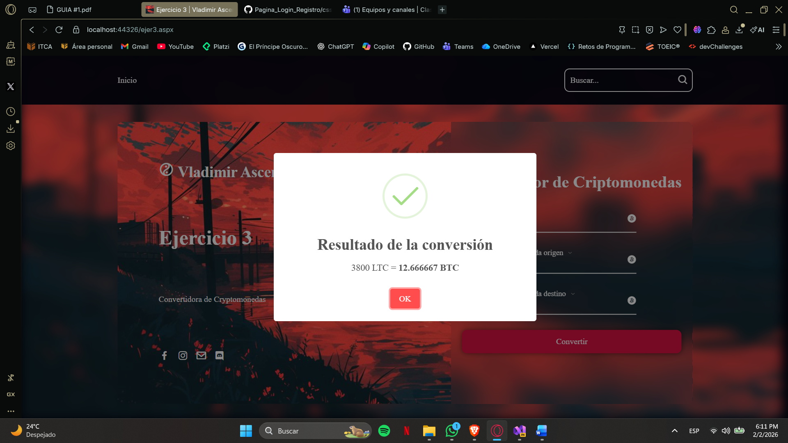

🔴🟡🟢

 

## 👤​​ Diseño de páginas web con ASP.NET Framework y Web Form

**Página web con ASP.NET**

<picture>
  
</picture>

Este repositorio contiene **la guía de ejercicios** que facilitan la comprensión de los conceptos necesarios para crear Web Forms.

✅ HTML básico con etiquetas básicas  
✅ CSS personalizado, breves animaciones y efectos 
✅ JS con funciones sencillas para el cambio de contenido con links  
✅ Sweet Alert usado para mostrar alertas; en este caso usado en JavaScript  

---

## 💡 ¿Qué encontrarás aquí?

- **La guía 1 de ejercicios** sobre ASP.NET.
- Código limpio, ordenado y fácil de entender.
- Plantilla a futuro para crear otros proyectos parecidos.

---

## 🎯 Propósito

Este proyecto está diseñado como práctica de **Diseño Web**, enfocado en entender la lógica y sintaxis intermedia antes de avanzar a proyectos más complejos.

Ademas de reutilizar código JS y CSS anteriores para optimizar el desarrollo. Además de practicar el uso de Sweet Alert para mejorar la experiencia del usuario.

---

## Ejercicio 1

- Ingresar los datos en el formulario

<figure>
  
</figure>

- Mostrara error si los datos no han sido ingresados y querer enviar el formulario
<figure>
  
</figure>

- Mostrara mensaje de exito si los datos han sido ingresados correctamente
<figure>
  
</figure>

 

## Ejercicio 2

- Ingresar los valores de A, B y C
<figure>
  
</figure>

- Mostrara el resultado del calculo
<figure>
  
</figure>

 

## Ejercicio 3

- Formulario para convertir criptomonedas a otros tipos de monedas
<figure>
  
</figure>

- Se selecciona la criptomoneda de origen
<figure>
  
</figure>

- Se selecciona la criptomoneda de destino
<figure>
  
</figure>

<figure>
  
</figure>

- Se muestra el resultado de la conversión
<figure>
  
</figure>

 

---
## ✨ Autor

Vladimir Ascencio – Desarrollador en aprendizaje continuo 🚀

¡Gracias por visitar este proyecto! 🐍😄

---

<h3 align="left">🔎 Contactos</h3>
<table align="center">
  <tr>
    <td align="center">
      
    </td>
    <td align="center">
      
    </td>
    <td align="center">
      
    </td>
    <td align="center">
      
    </td>
  </tr>
</table>

  

  ---

<!-- Footer -->

  

